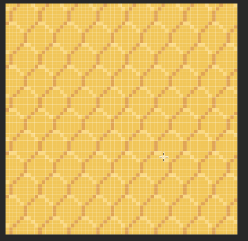
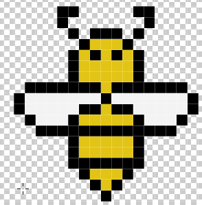
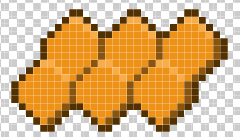
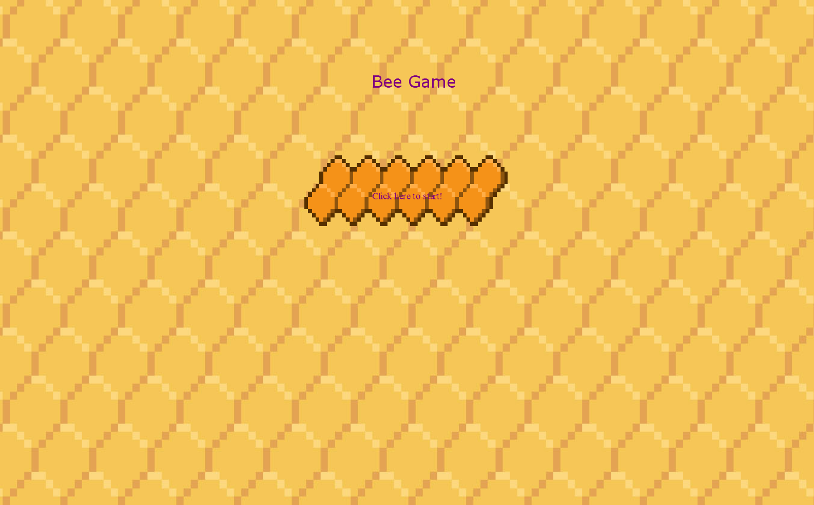

# Art and Interface

## Overview

The art for the game will all be pixel art with a cartoony feel to all of the sprites. The game will also maintain a bee theme. As of the time this overview was last updated (10/17/2019) the game will have hexagon themed menu's to mimic the partern of a bee hive.
most of the art currently in the game is temporary at the moment and will be updated, or changed later on in the project.

The overall flow of the game (gamestates) will consist of a main menu, game, win, and lose state which will be changed in a switch statment in the update method given the proper condition.

If you are in the main menu and push the start button, the current gamestate will go to game. If you kill all the enemies, the gamestate will continue to win. If the have or player dies, the gamestate will continue to lose. if the play again button is pressed in either win or lose, gamestate will return to game. If the menu button is pressed in either win or lose, gamestate will go back to menu.

There is also a pause Menu that is accessed by pressing the key p in the game state.

Powerups and stinger textures have been implemented.

spritefonts have been added/updated, we now have a sprite font for verdana and impact. These were used for headers and regular labels respectivly.

buttons have a hover/click visual update (color change)

## Concept Art
Menu Background

     
     
     
Bee Sprite

     
     
     
Buttons for Menus

## Game Mode <A>

### Mockups
Main menu screenshot

## Game Mode <B>

### Mockups

### Screenshots & Demo Videos

## ...
